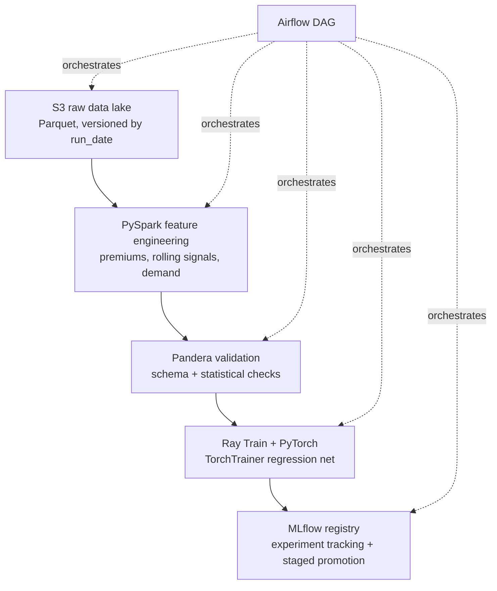

# ml-pipeline

An offline ML training pipeline that predicts sneaker resale **price premium**
from StockX sales data. This is a portfolio **infrastructure** project: the
model is deliberately simple, and the pipeline patterns around it — data lake
layout, Spark feature engineering, dataset validation, distributed training,
experiment tracking, model promotion, and Airflow orchestration — are the
point. Every architectural decision is meant to be explainable in terms of
reliability, reproducibility, and scalability.

This is the documented **Phase 2** of [sneaker-intel](https://github.com/smalik-25/sneaker-intel) —
the ML layer explicitly deferred in that project's roadmap. sneaker-intel built
the data engineering foundation (a hand-written Postgres star schema over ~99K
StockX sales with a full dbt transformation layer); this repo builds the ML
infrastructure on top of it.

## Architecture



Each stage is independently runnable from the CLI and communicates with the
next only through Parquet at an S3 (or local) path. The Airflow DAG is the
source of truth for pipeline topology; it orchestrates the stages but does not
contain their logic.

## Tech stack

| Concern | Tool |
|---|---|
| Storage / data lake | AWS S3, Parquet (local filesystem in dev/CI via the same I/O layer) |
| Feature engineering | PySpark |
| Dataset validation | Pandera |
| Model | PyTorch (simple feedforward regression) |
| Distributed training | Ray Train (`TorchTrainer`) |
| Experiment tracking / registry | MLflow (Postgres backend, S3 artifacts) |
| Orchestration | Apache Airflow (LocalExecutor) |
| Packaging / CI | Docker, GitHub Actions, ruff, pytest |
| Language | Python 3.11 |

## Storage abstraction (dev vs prod)

Every stage reads and writes through one helper (`stages/io.py`) that resolves
the filesystem from the URI scheme: `s3://…` in production, a local path in
dev/CI. Both flow through identical code, so fixtures exercise the real I/O
path. Switching environments is a one-line change to `storage_root` in
`config/pipeline_config.yaml` (or the `STORAGE_ROOT` env var). A MinIO compose
file is provided for anyone who wants a faithful local S3 API, but it is not on
the critical path.

## Running a stage independently (no Airflow)

```bash
make install                      # pip install -e ".[dev]"
make fixtures                     # generate synthetic data into data/fixtures/
make ingest   RUN_DATE=2025-01-01
make features RUN_DATE=2025-01-01
make validate RUN_DATE=2025-01-01
make train    RUN_DATE=2025-01-01
make register RUN_DATE=2025-01-01
make pipeline RUN_DATE=2025-01-01 # all stages in order
```

Each stage is also a module entrypoint, e.g.
`python -m stages.features --run-date 2025-01-01 --config config/pipeline_config.yaml`.

## Running the full DAG

```bash
make mlflow-up      # local MLflow (Postgres backend + S3 artifacts)
make airflow-up     # local Airflow (LocalExecutor); UI at http://localhost:8080
# trigger the `sneaker_training_pipeline` DAG from the Airflow UI
```

MLflow tracking: leave `MLFLOW_TRACKING_URI` unset for a zero-setup local run —
the train/register stages default to a SQLite store (`sqlite:///mlflow.db`),
which backs both experiment tracking and the model registry. Point it at the
compose server (`http://localhost:5000`) for the production-pattern
Postgres + S3 setup. (The legacy file store is deprecated in MLflow 3.x and
can't back the registry, so we don't use it.)

## Source data

The production source is the sneaker-intel Postgres warehouse (`fact_sales`,
`dim_shoes`, `dim_drops`, `fact_search_interest`). It does **not** need to be
reachable to run this pipeline: set `SNEAKER_INTEL_DSN` to do a real export, or
leave it unset and run on synthetic fixtures (the default dev/CI path). The 99K
real rows are the production story; fixtures make the whole pipeline runnable
and testable with one command.

## Build progress

- [x] **Phase 0** — Project scaffold, shared I/O layer, config, packaging, CI skeleton
- [x] **Phase 1** — Data lake layer & ingest stage (+ fixtures)
- [x] **Phase 2** — PySpark feature engineering
- [x] **Phase 3** — Pandera dataset validation
- [x] **Phase 4** — PyTorch model & Ray Train + MLflow
- [x] **Phase 5** — MLflow model registry & promotion logic
- [ ] **Phase 6** — Airflow DAG orchestration
- [ ] **Phase 7** — Docker, CI/CD, and docs polish

## Design decisions

Recorded as they are made; see [`DEVLOG.md`](./DEVLOG.md) for the full narrative
and rationale.

- **Parquet at every stage boundary** — columnar, typed, splittable; never CSV
  between stages.
- **One fsspec-resolved I/O layer** — stage code is identical against S3 and
  local; fixtures exercise the real path; CI needs zero S3 setup.
- **Stages runnable independently of Airflow** — Airflow orchestrates stages, it
  does not define them. Inter-stage state passes only via S3 paths (XCom in the
  DAG), never shared local state.
- **Fixture-first, real-but-gated Postgres ingest** — the pipeline runs
  end-to-end on synthetic data; the live warehouse is one env var away.
- **Python 3.11 + split dependency extras** — the highest version all four heavy
  frameworks support cleanly; extras keep lint/DAG-import CI fast.

- **Broadcast joins for small dimensions (Phase 2)** — `dim_shoes` and the
  per-brand average premium are broadcast rather than shuffled; `brand_avg_premium`
  is a standalone aggregate joined back, avoiding a full-table window.
- **Partition features by brand (Phase 2)** — brand-filtered training reads one
  partition instead of the whole dataset.
- **Google Trends over Reddit as the demand signal (Phase 2)** —
  `fact_social_posts` is too sparse in sneaker-intel; `search_index` is the
  reliable signal.
- **Microsecond Parquet timestamps (Phase 2)** — coerced at the I/O layer so the
  lake is readable by both pyarrow and Spark 3.5.
- **Pandera over ad-hoc validation (Phase 3)** — declarative checks double as a
  data contract; lazy validation reports every failing column/check/row count.
  The rolling-null rule is a custom cross-row check, outliers are flagged not
  dropped, and a ≥90% row-retention check guards the stage boundary.
- **Temporal train/val split (Phase 4)** — train on pre-2023 sales, validate on
  2023+, so the model is always evaluated predicting forward in time; a random
  split would leak future information.
- **Ray Train even on a single machine (Phase 4)** — `TorchTrainer` with
  `prepare_model`/`prepare_data_loader`/checkpointing, so multi-worker/GPU
  scaling is a `ScalingConfig` change rather than a rewrite. Preprocessing is fit
  on train only and saved inside `model.pt` for leakage-safe inference.
- **Promote only on strict improvement (Phase 5)** — every run is registered for
  lineage, but the `staging` alias moves only if the candidate beats the
  incumbent's val RMSE; a worse model warns instead of failing. Uses MLflow 3.x
  aliases (stages are deprecated) and every decision leaves a
  `promotion_report.json`.
