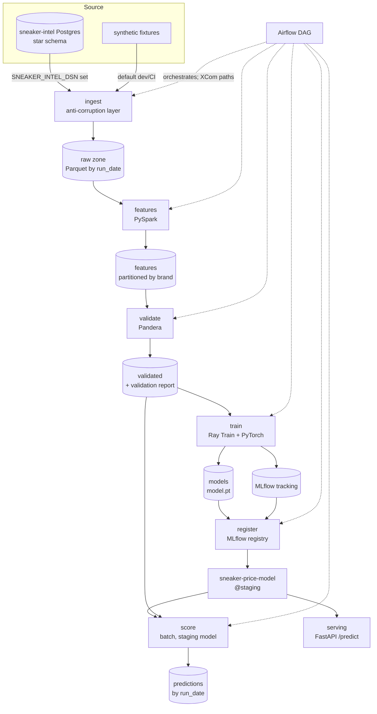

# Architecture

This is an offline ML training pipeline I built to predict sneaker resale **price
premium** from StockX sales. This doc covers the topology, what the data looks
like at each stage boundary, and mostly why I made the choices I did. The model
is simple on purpose; the pipeline around it is what I wanted to get right.

## Pipeline topology

Each stage runs on its own from the CLI and talks to the next one only through
Parquet at an S3 (or local) path. The Airflow DAG is the source of truth for the
topology. It orchestrates the stages but holds none of their logic.

## Data at each prefix

All paths come from `storage_root` in `config/pipeline_config.yaml` via
`PipelineConfig` (`stages/config.py`). Nothing hardcodes a path.

| Prefix | Written by | Contents |
|---|---|---|
| `raw/{run_date}/` | ingest | One canonical Parquet per source table: `sales`, `shoes`, `drops`, `search_interest` |
| `features/{run_date}/` | features | Flat engineered feature table, Hive-partitioned by `brand` |
| `validated/{run_date}/` | validate | Validated features + `validation_report.json` |
| `models/{run_date}/{run_id}/` | train, register | `model.pt` (weights + preprocessing) + `promotion_report.json` |
| `predictions/{run_date}/` | score | `predictions.parquet` + `scoring_report.json` |
| `failures/{run_date}/` | DAG callback | Per-task failure summaries on any task failure |

The model artifact also goes to the MLflow tracking store (SQLite locally, or the
Postgres+S3 server via `MLFLOW_TRACKING_URI`), and the registry holds the
versioned model plus the `staging` alias.

### Features computed

The target is `price_premium = (sale_price - retail_price) / retail_price`. The
feature stage takes the sneaker-intel dbt `int_sales_enriched` logic and
re-implements it on the Spark compute layer, then extends it:
`days_since_release`, `size_premium` (a size's premium relative to its shoe's
baseline), `release_type_encoded` (ordinal scarcity), `rolling_7d_avg_premium`
(a time-range window, null when a shoe has under 7 days of history),
`search_index_7d_pre_drop` (Google Trends demand before the drop), and
`brand_avg_premium` (a broadcast-joined per-brand mean).

## Ingest as an anti-corruption layer

The real sneaker-intel warehouse doesn't match my canonical schema one-to-one. It
uses `shoe_key`, `sold_price`, `sold_date`, `size`, `interest`, `point_date`, and
the per-release `retail_price`, `release_date`, and `release_type` live in
`dim_drops` rather than `dim_shoes`. Instead of letting those names leak into five
stages, I kept ingest as the one place that knows the source schema. Its SQL
aliases every column, casts Postgres `numeric` to float, and rolls each shoe's
canonical (earliest) drop up onto the shoe row. The Parquet it lands is
byte-compatible with the synthetic fixtures, so features, validate, train, and
register never learn where the data came from. The fixtures run through the same
downstream code, which is what makes dev and CI faithful without a database.

## Serving and batch scoring

Training and promotion produce a *deployed* model, and two consumers use it. The
batch scoring stage (`stages/score.py`) and the FastAPI app (`serving/app.py`)
both load whatever version sits at the `staging` alias and score with it. The
batch stage writes predictions to `predictions/{run_date}/` and reports RMSE
against ground truth when the batch is labeled; the API serves single or batch
predictions online.

Both go through one module, `stages/inference.py`, which is the point. It loads
the `model.pt` (weights plus the imputation and standardization stats fit on the
training split) and applies those saved stats at inference. There is no second
copy of the preprocessing to drift, so an online request and a batch row get
byte-identical treatment. The registry alias is the source of truth for which
model is live: to roll back, you move the alias, and both consumers pick it up on
their next load.

## Design decisions

**Parquet at every stage boundary.** Columnar, typed, splittable, and it supports
predicate pushdown and partition pruning. Never CSV. I coerce timestamps to
microseconds at the I/O layer so the lake reads cleanly in both pyarrow (the
Python stages) and Spark 3.5, which rejects nanosecond Parquet.

**One fsspec-resolved I/O layer.** Every stage reads and writes through
`stages/io.py`, which picks the filesystem from the URI scheme: `s3://` in prod,
a local path in dev/CI. Same code in both, so the fixtures exercise the real I/O
path and CI needs zero S3 setup. `storage_root` is the one knob that switches
environments.

**Stages run independently of Airflow.** Airflow orchestrates the stages, it
doesn't define them. State passes between stages only as paths (XCom in the DAG),
never as shared local state. The DAG's tasks are thin wrappers that call each
stage's `run()`, and they import the heavy libraries inside the callables, so DAG
parsing stays fast and the graph is testable without Spark or Torch installed.

**Config is the single source of truth for paths.** No stage hardcodes a path;
each one asks `PipelineConfig`. The DAG still threads the concrete artifact URIs
through XCom for lineage and observability, but the stages derive their paths from
config. That keeps the single-source-of-truth invariant while still showing the
XCom pattern.

**Temporal train/val split.** I train on earlier sales and validate on later
ones, so the model is always judged predicting forward in time. A random split
would leak the future: the model could see a shoe's later sales while predicting
its earlier ones, which inflates metrics that wouldn't hold in production. The
split year is configurable (`--split-year`) because it depends on the data's date
range: 2023 for the synthetic 2021–2024 fixtures, 2019 for the real 2017–2019
StockX data.

**Ray Train even on a single machine.** The loop runs inside
`ray.train.torch.TorchTrainer` with `prepare_model`, `prepare_data_loader`, and
checkpointing, rather than a raw loop or `DataParallel`. On one machine it behaves
like a normal run, but scaling to more workers or GPUs becomes a `ScalingConfig`
change instead of a rewrite. I fit preprocessing (imputation and standardization)
on the train split only and save it inside `model.pt`, so inference reproduces
the exact pipeline with no leakage.

**Pandera over ad-hoc validation.** The checks are declarative, so the schema
doubles as a data contract, and lazy validation reports every failing column,
check, and row count in one pass. The rolling-null rule is a custom cross-row
check, outliers get flagged rather than dropped, and a ≥90% row-retention check
guards the stage boundary. This is the seam that caught the real-data surprises
below.

**MLflow: SQLite locally, registry via aliases.** MLflow 3.x deprecated the file
store and it can't back the registry, so the stages default to a SQLite store,
which backs both tracking and the registry. The promoted version is marked with a
`staging` alias (stages are deprecated). Promotion is strict: I always register a
model for lineage, but the alias only moves if the candidate beats the current
model's val RMSE. A worse model logs a warning rather than failing.

## What real data changed (and what caught it)

Connecting the live warehouse surfaced four assumptions the synthetic data had
quietly gotten wrong. The validator caught each one, and I fixed each as a
documented config change rather than a silent patch.

- **`release_type` vocabulary** is `{general, limited, collab}`, not the synthetic
  `raffle/fcfs/...`. I fixed it in `feature_config.yaml`; validation's `isin` set
  derives from there.
- **Premium outliers.** Real Off-White resale reached ~20.3× retail, which would
  have failed my original `[-1, 20]` bound. I raised the ceiling to 50 and treat
  anything over 50× as a data error.
- **Transaction grain.** Real resale legitimately has many sales of the same
  shoe/size/day, so I dropped the `(shoe, date, size)` uniqueness check and rely
  on `sale_id`, which is the true key.
- **Pre-release sales.** About 5.6% of sales traded before the official drop (min
  −69 days). `days_since_release_min` is now a config value set to −90, a bounded
  pre-release window that still flags grossly wrong dates.

On the full 99,956-row StockX dataset the pipeline ran end to end. Validation
passed at 100% retention, and the model trained to val RMSE ≈ 0.21 with an 84/16
temporal split at 2019, then registered and promoted as v1.
